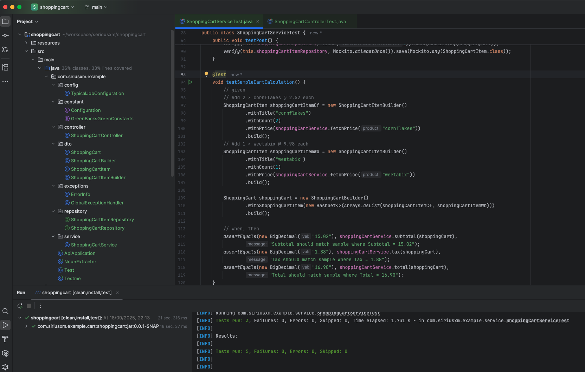
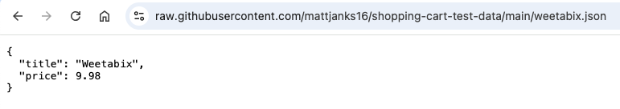
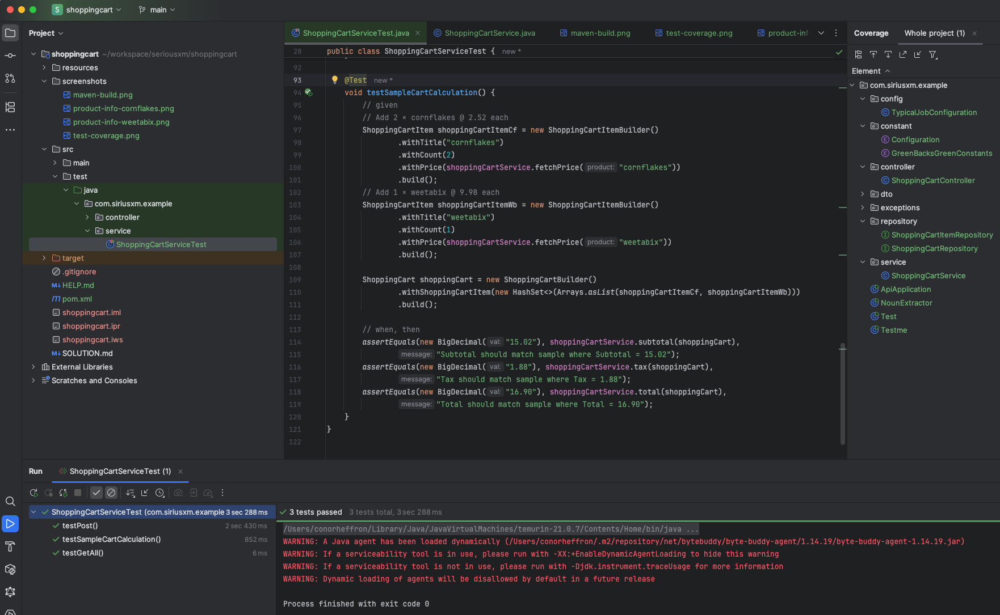
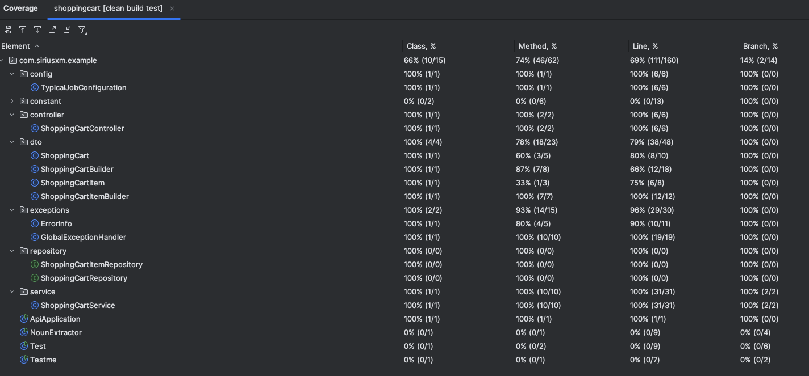
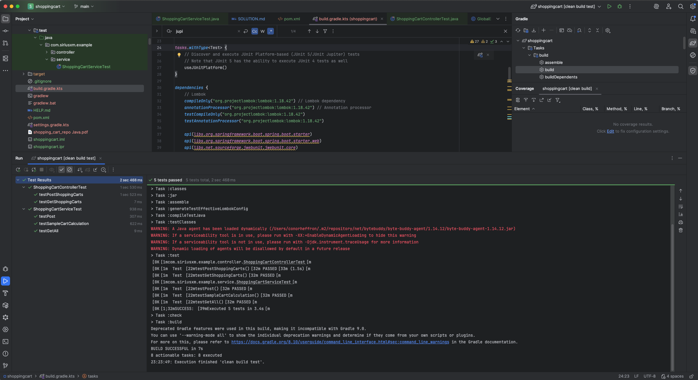

# shoppingcart-java

[](https://github.com/conorheffron/shoppingcart-java/actions/workflows/gradle.yml)

[](https://github.com/conorheffron/shoppingcart-java/actions/workflows/sonarcloud.yml)

[](https://sonarcloud.io/summary/new_code?id=conorheffron_shoppingcart-java)

[SonarQube Overall Code Summary](https://sonarcloud.io/summary/overall?id=conorheffron_shoppingcart-java&branch=main)

## Tech:
 - Java 21 (LTS), Maven 3.9.9, Gradle 8.1, IntelliJ IDEA 2025.2.1 (Community Edition), SonarQube, JaCoCo

## Maven Build
```
shoppingcart % ./gradlew clean build test
```


## Preview Product Info by Cereal ID(S) to find associated single unit 'price'
 - Cornflakes

 - Weetabix


## Sample Test Case as JUnit test (including JSON data fetch call(s))


## Test Coverage Report


## Convert to Gradle Build & Run with Tests
 - `gradle init --type pom`


